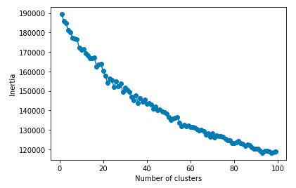
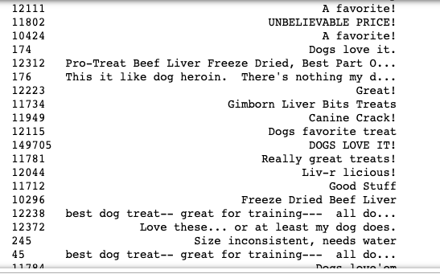
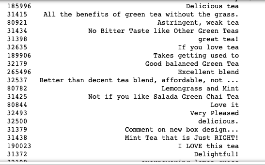
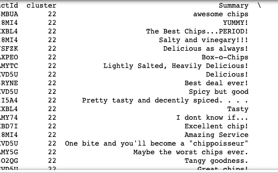

# Machine Learning Assignment 3
## Unsupervised, Clustering
### Task: Cluster Amazon food reviews to create a recommendation engine for Amazon products
## Iteration 1
### Changes Made
* Added strip_accents='ascii' to the CountVectorizer()
* Added stop_words='English' to the CountVectorizer()
* Added ngram_range=(1,2) to the CountVectorizer()
### Current Number of Clusters: 32
I am currently using 32 clusters. There are a lot of clusters on tea, coffee, chips etc., but the clusters are about different types of these products. As of now, I think more clusters is better to create more specific groups.

## Final Iteration
### Changes Made
* changed ngram_range from (1,2) to (1,1)
* Looked at elbow graph showing clusters of sized 1 to 100 to see a wider range and find where the elbow really is.
### Final Number of Clusters: 25
The amount of clusters I chose is 25. The elbow on my elbow graph seemed to be around 22 to 25, so I chose 25. The resulting clusters seem to be clustered well. There are clusters with dog food products, pop tarts, coffee, tea, etc. and they all go together well. They are also all very similar in size which is what I wanted. As the number of clusters went up, the size of the individual clusters started to vary more and there started to be clusters with basically the same products. 25 is a good cluster amount that has distinct clusters that are still similar in size. I had to find a good place between having too many similar clusters and having enough clusters so that the distinction between the products was enough but not overdone. There is one outlier cluster that has a lot of random items, but I think only having one of these outlier clusters is good. 

## Other iterations I tried
* I also tried using the TfidfVectorizer for my bag of words, but the resulting elbow graph didn't have a distinguishable elbow and the resulting clusters did not go together at all

### Final Elbow Graph

### Example of Final Clusters

A cluster with dog food products

A cluster with tea products

A cluster with chip products
