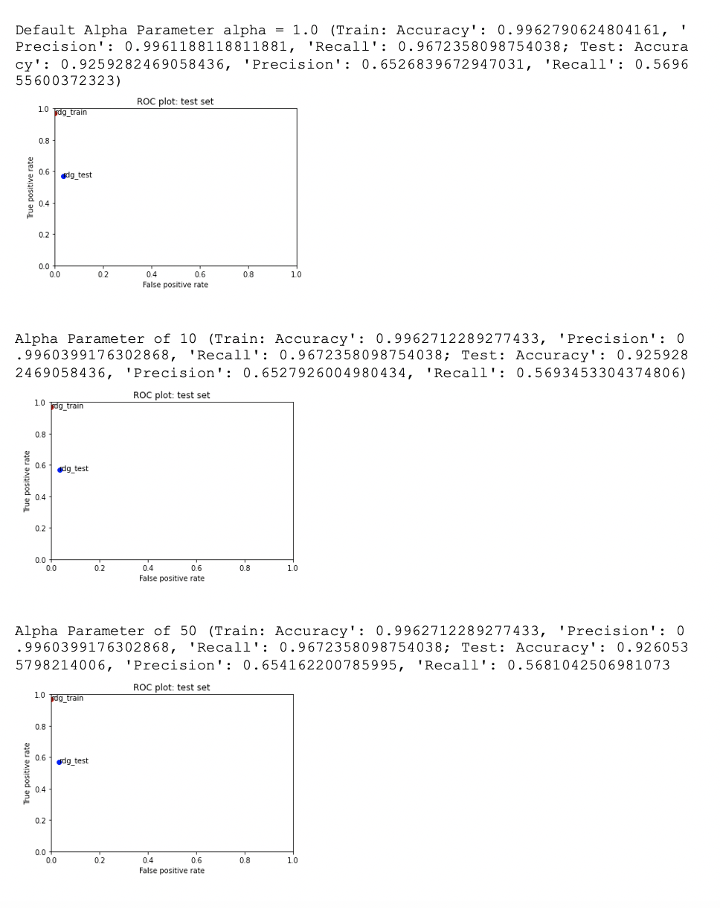
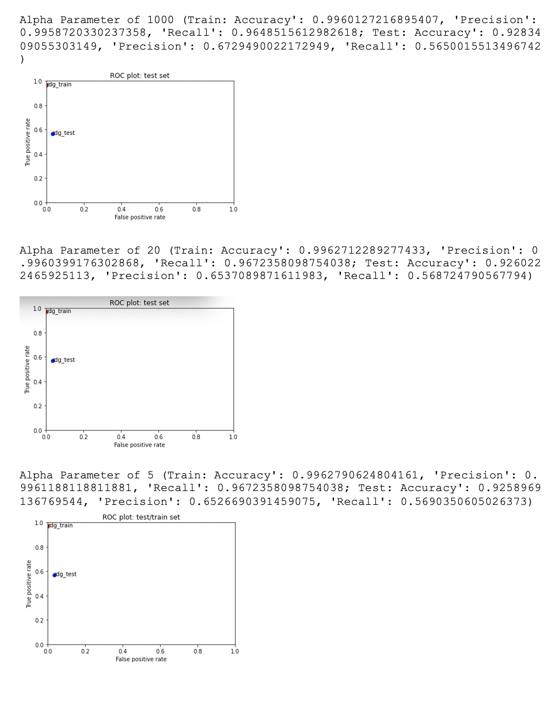
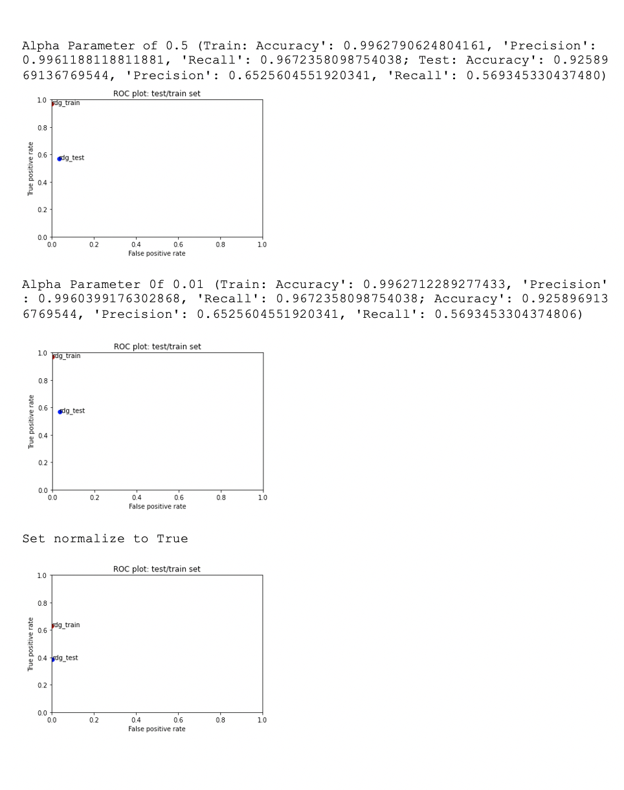
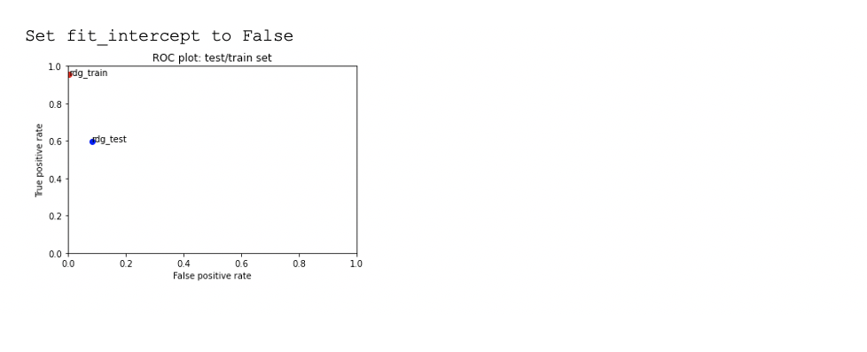

# Canvas Discussion Assignment 2
## Process

I started this assignment by displaying the ridge classifier plot with the default alpha value. I noticed that the training and testing data was already doing really well with the default alpha value so I was skeptical of what changing it would do. I tested out an alpha parameter of 10, which didn’t change the train and test values that much. I included the accuracy, precision, and recall values for each train and test run of each of the different alpha parameters because the difference was so small and therefore not visible in the ROC plots. I then tested alpha = 50 and alpha = 1000 to see if there was any change if I increased the alpha parameter by a lot. This resulted in a noticeable decrease in accuracy, precision, and recall in both the training and test set.

I checked alpha = 5, alpha = 10, and alpha = 20, which didn’t have any significant change compared to the default value of alpha = 10. I then switched to checking smaller values. I checked alpha = 0.5 and alpha = 0.01. These decreased the accuracy, precision, and recall of the train and test sets a little bit, so I ultimately decided to stick with the default value of alpha because it seemed to do the best.

I then checked other parameters in the ridge classifier to see what would happen. I set normalize to True, instead of its default False and it drastically decreased the performance on the model. I also changed fit_intercept to False, instead of its default True and it decreased the performance of the model as well. I set both of these parameteres back to their default after seeing that changing them created worse performance.

### Results of the different alpha parameters I tried

