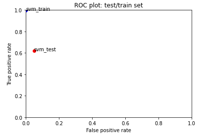
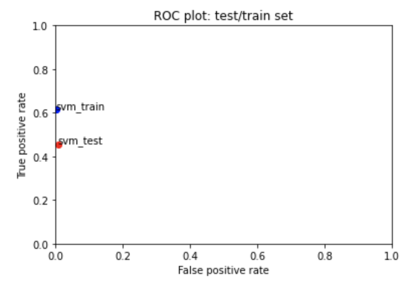
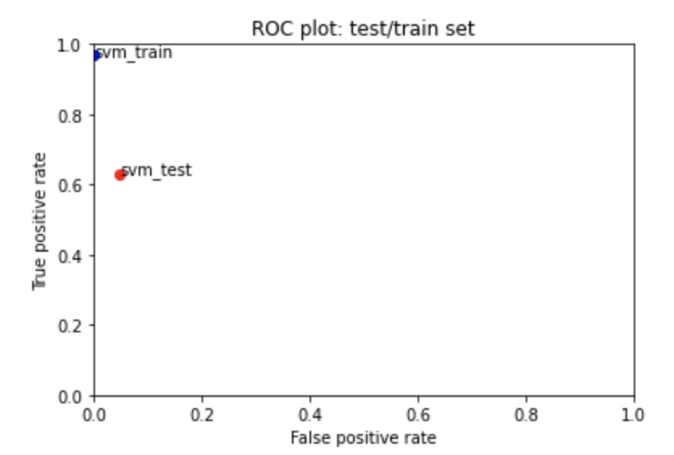
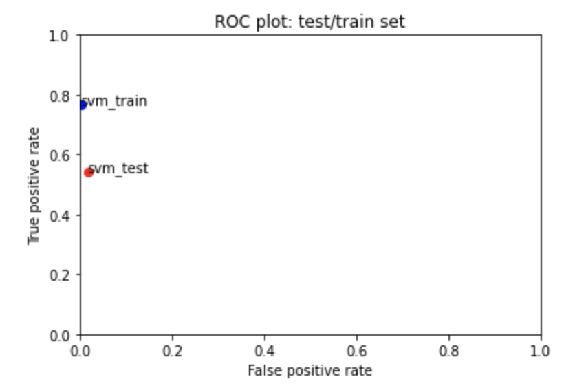
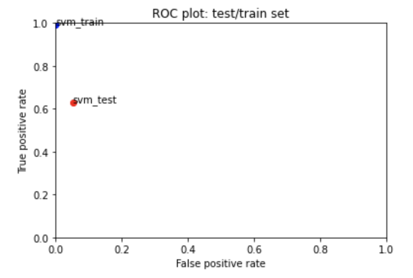
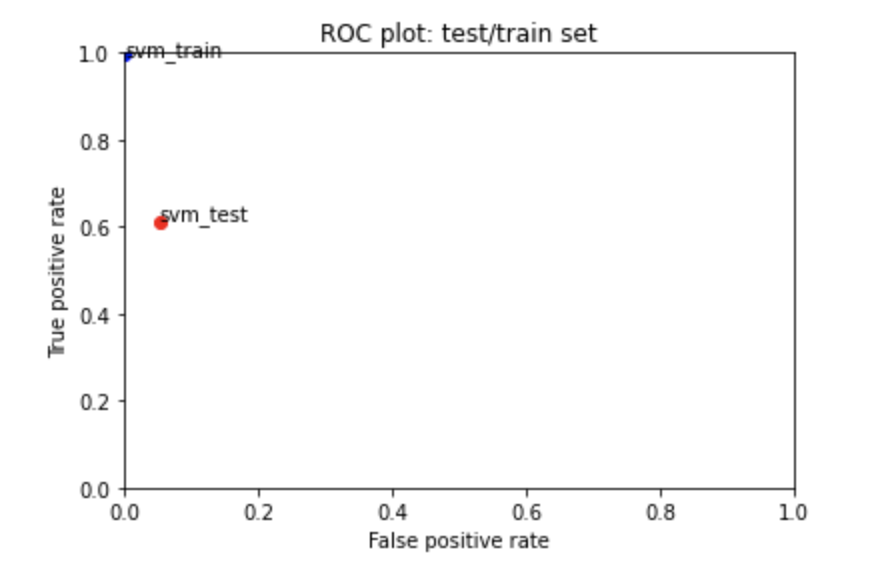
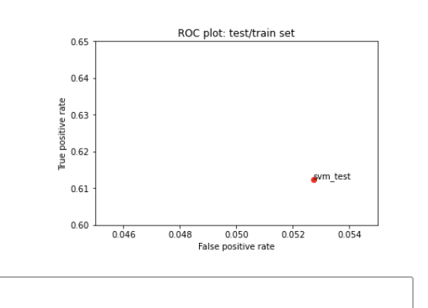
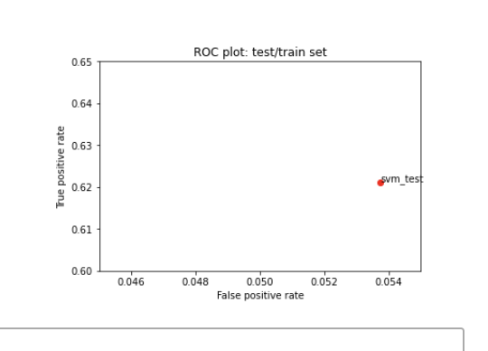

# Canvas Discussion Assignment 3
## Process
Note: As C goes up less points are counted, regularization is inversely proportional to C. But, the higher the alpha value, the stronger the regularization, the more points are counted.
I started by looking at how the default alpha value (alpha = 0.0001) does. This one was already doing very well. There is little regularization here. 

### First Change
I started by testing alpha=1, which has high regularization. The FP rate for both the test and train set went down to basically 0, but the TP rate went down from 1.0 to 0.6 for train and from a little over 0.6 to a little over 0.4 for test. I think it is more important for this assignment to have a better true positive rate because it is more important to tag every possible toxic comment and if there are a few falsely tagged toxic comments it is not the end of the world. It is better to tag a non toxic comment as toxic than a toxic comment as not toxic. So, Even though alpha=1 did better on the false positive rate, because of its poor performance on true positive rate I'm not considering it as a good alpha value.

### Second Change
Next, I tried alpha values in the range between 0.0001 and 1.0, expecting that numbers closer to 0.0001 would do better. My second try was alpha = 0.1, but this did not change much from alpha=0.0001.

### Third Change
For my third change, I tried alpha = 0.5 just to see if somewhere between 0.1 and 1.0 would do well. This value did not do well. The true positive rate was still lower than the TP rate for alpha=0.0001 and was not better than the TP rate for alpha=0.1.

### Fourth Change
I then tried alpha = 0.05 but this got a very similar TP and FP rate as alpha =0.0001.

### Fifth Change
I realized at this point that the TP and FP rate didn't change from for values of alpha between 0.0001 and 0.1, so I tried alpha=0.00001 so see if a value under 0.0001 would do better. alpha = 0.00001 did a little bit worse than alpha = 0.0001 on the TP rate. I have included a screen shot on the performace for alpha=0.00001 as well as a close up of the performance on the test set for alpha=0.00001 and alpha=0.0001 to show the close results between them, but that ultimately alpha=0.0001 did better.

### Small 0.00001

### Small 0.0001

## Conclusion
In the end, I determined that the default value alpha=0.0001 did the best for the SVM model. This made me conclude that high regularization does not have much of an affect here and therefore is not needed, so the smaller regularization does the best. I am interested is playing around with other parameters in the SVM model to see if changing any make the model do better. 
