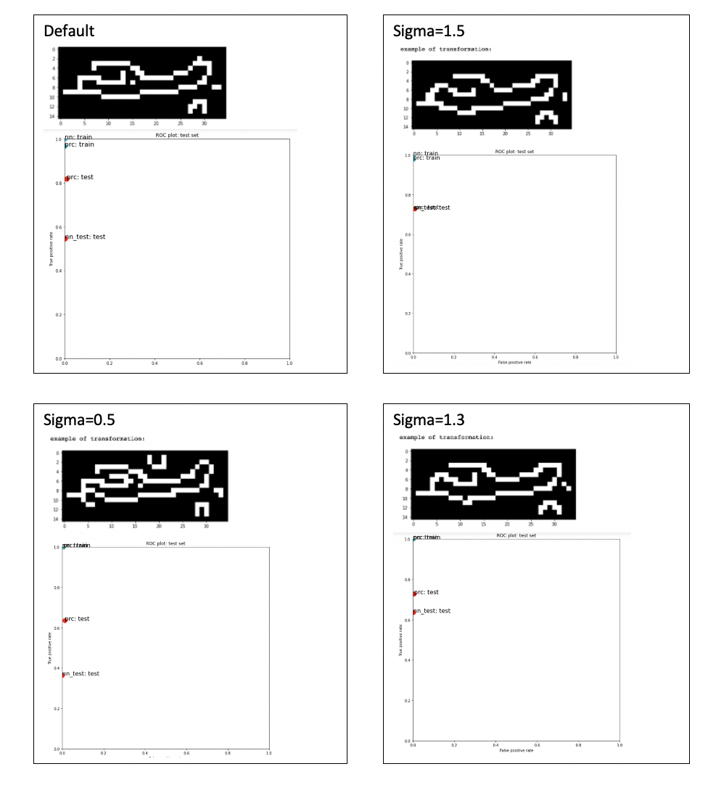

# Canvas Discussion Assignment 4
## Process
### Feature.canny
I started this assignment by playing around with the feature.canny feature set representation. This was the default feature set representation for this assignment. I tested out several different sigma values to see if this would have any effect on performance.

I tested the default sigma, sigma=1.5, sigma=0.5, and sigma=1.3. The multilayer perceptron TP test rate went up for sigma=1.5 compared to the default, but the perceptron TP test rate went down. Both the perceptron and multilayer perceptron did worse for sigma=0.5. At this point, I noticed that the perceptron model was doing best for all of these and I concluded that a sigma value between 1.0 and 1.5 would do the best. I tested out multiple sigma values in between 1.0 and 1.5. For sigma=1.3, the perceptron did worse than the default sigma value. The multilayer perceptron did better than the default sigma, but still not as good as the perceptron. None of the other values between 1.0 and 1.5 did better than the default either, so I concluded that the default value of sigma was the best.

If I decide to use feature.canny for my final iteration, I will use the default sigma and the perceptron model.

I have included the images of my tests below:

### HOG

Next, I tried out the HOG feature set representation.

I started with the default values, already HOG was doing a lot better for perceptron and multilayer perceptron than feature.canny.

I played around with different orientation valyes but found that anything below 8 made the lines of the transformation image get less specific and anything above 8 didn't change the image, if anything it made the image blurrier. For this reason, I decided to stick with orientations=8.

Then, I played around with pixels per cell. I started by just looking at the sample transformation image. The sample image got worse when I went higher than (16,16) so I tried smaller numbers. When I went farther down, the image started looking more like a plane. The smallest I could go while still getting an image was (2,2).

(2,2) had better performance for the perceptron test, but much worse performance for the multilayer perceptron test. Both of the train performances were perfect so I suspected there may have been some overfitted and I tried values higher than (2,2).

I tried (8,8) and the perceptron train and test performance got worse, while the multilayer perceptron train/test performance got better. I tried a slightly higher value (10,10) and the train performances were nearly perfect and both of the perceptron and multilayer perceptron test performances went above .8, with the multilayer perceptron doing a little bit better. This was definitly the best performance by far. I ran (10,10) three times and the values for prc and nn fluctuated around .8 everytime. I tried (12,12) to see if this would increase performance, but both the perceptron and multilayer perceptron did worse. I tried (9,9) and (11,11) to see if going a little bit higher or a little bit lower than (10,10) would do better, but they both did worse than (10,10).

I have included the images of these tests below:

### Conclusion

As of now the HOG with all of the default values (except pixels per cell = (10,10)) is doing the best for the perceptron and the multilayer perceptron, with a little bit higher performance on the mulitlayer perceptron. Some of the other models do better for nn or prc individually so I will keep that in mind when I decide which one I ultimately use.

### Next Steps

* I want to play around with Blob Detection and see if it has better performance. I think it could do well.
* I want to play around with the parameters of prc and nn to see if this makes any changes.
