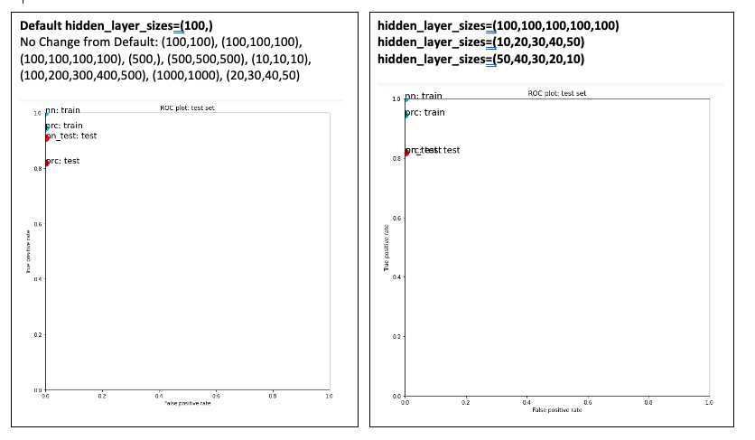

# Canvas Discussion Assignment 5
## Process

For this assignment the goal was to show the effect of multiple alterations on the hidden_layer_sizes parameter for a neural network. 

I tested out 12 different hidden layer combinations. My aim was to test out different neuron sizes and different amounts of layers to see which one had the best result.

I started with the default value which was (100,). Then I tested out (100,100) , (100,100,100) , (100,100,100,100) , and (100,100,100,100,100) to see if changing the amount of hidden layers has any effect. I saw that there was no change until I went up to 5 hidden layers. At 5 hidden layers the multi layer perception test performance went down. The training performance stayed the same for all of these cases.

Then, I wanted to test out bigger neuron values so I tested (500,) and (500,500,500) and there was no change. I also tried a much smaller neuron value, (10,10,10), which also did not have any change and a much bigger neuron value, (1000,1000), which did not have any change. 

Then I tested out variations in neuron sizes within each layer. I tried (10,20,30,40,50) which made the test performance go down and I tried (100,200,300,400,500) which resulted in no change from the default value. I also tried (50,40,30,20,10) to see if having the amount of neurons going down per layer was any different. This resulted in the test performance going down to the same value that (10,20,30,40,50) was at. 

At this point, it seemed that the only changing factor was the amount of hidden layers, specifically that the performance goes down when there are 5 layers. To test this theory I then tested (20,30,40,50) and found that there was no change on test performance.

I have included images of my results below:

## Conclusion

From these tests, I conclude that there is no change in test performance unless there are more than 4 layers. I think it would be beneficial to test a few more varieties to know if this theory is always true. The test performance results I got varied between just 2 values (a little above 0.8 and a little below 0.9) for every instance. Overall, because there was no change that resulted in a test performance better than the default, I will keep the default parameter value of (100,).
