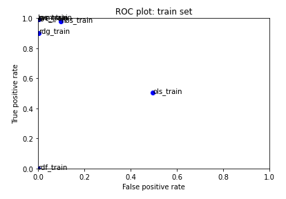
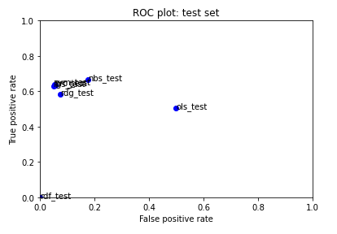
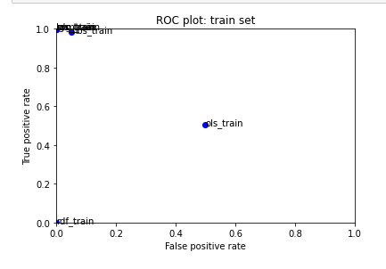
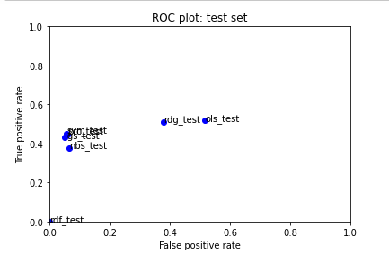
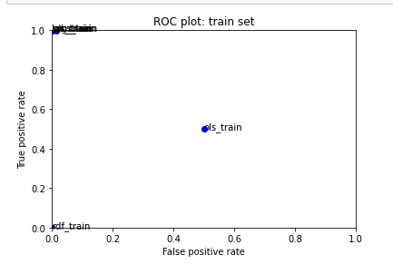
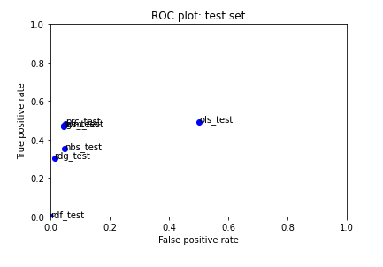
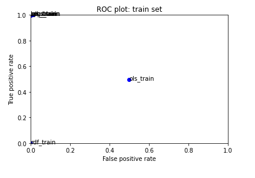
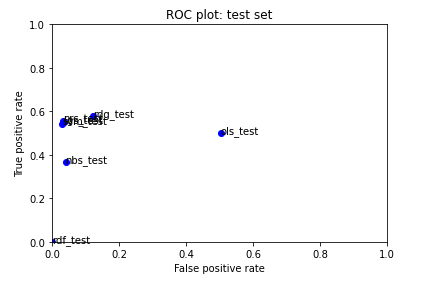

# Canvas Discussion Assignment 1

## Process

To start, I changed my parameter random_state to 95. Taking a quick look at the data, some things I am interested in looking at, that I think are common in the toxic comments, are all caps words, punctuation, and groups of words together. These are just some things I picked up on first glance at the data, I eventually want to explore more than this. I noticed there aren’t a lot of all caps words so I want to add this later. There also isn’t a lot of punctuation used, so I’ll look at this later too. For the future, I’m interested in when there are explanation points and text in parentheses. 

For now, I decided to just focus on pairings of words. 

### First Change

I started by changing the Hashing vectorizer to include only bigrams. I changed the hashing vectorizer variable to this:

    hv = HashingVectorizer(n_features=2 ** 17, alternate_sign=False, ngram_range = (2,2))

This didn’t change much. The training and testing plots went from this:



To this:

This change resulted in the ridge regression model doing better, but didn’t make any change anywhere else.

### Second Change

I then tried getting rid of the n features parameter, so I did this:

    hv = HashingVectorizer(alternate_sign=False, ngram_range = (2,2))

This had a better result. False positive rate went down for most of them, but the true positive rate went up.

Here are the plots:




### Third Change

Then, finally, I included both unigrams and bigrams, to see if includong all single words and groups of two words would change anything.

    hv = HashingVectorizer(alternate_sign=False, ngram_range = (1,2))

This did the same on the training set, but better on the test set. A lot of the models had better true positive rates. Plots are below:




### Next Steps

I want to look at including more groupings of words (i.e. trigrams). I think this will end up getting better results. 
